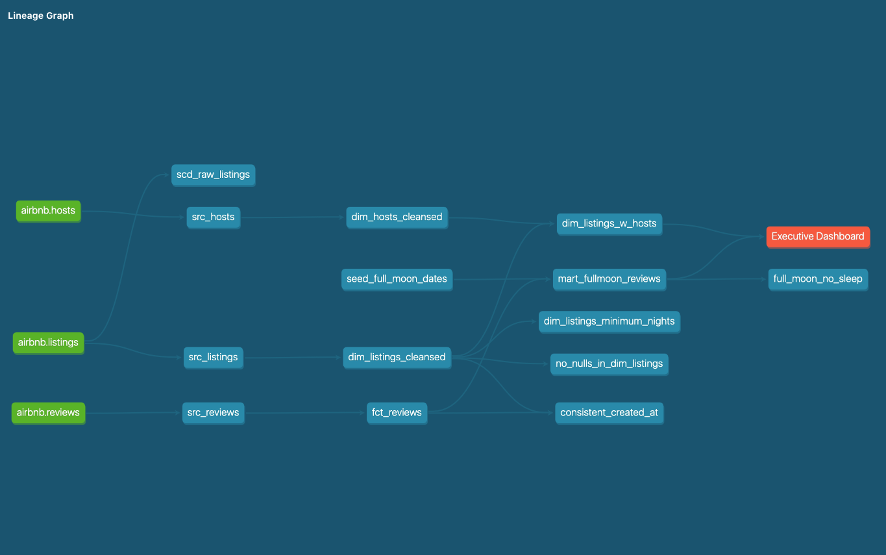
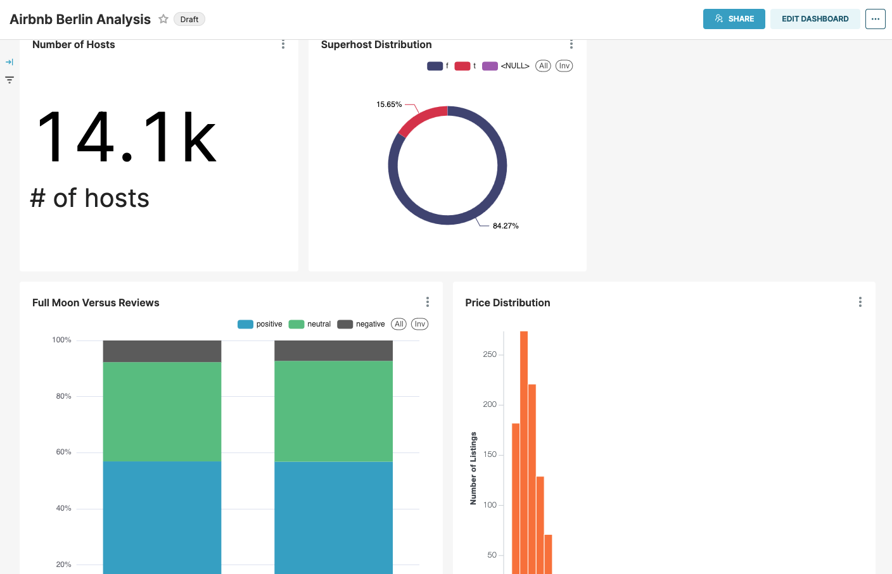

Airbnb Berlin Data Pipeline
This project uses dbt, Snowflake and Preset for an ELT pipeline

### Using the starter project

Try running the following commands:
- dbt run (for running dbt)
- dbt test (for checking if the tests are valid)
- dbt compile (for compiling dbt code to SQL. You can find the SQL code in target folder)
- dbt docs generate (for generating documentation from md and yml files. You should use this command before serving)
- dbt docs serve (for serving the documentation on localhost:8080)

## This is the lineage graph for the pipeline

## Preset dashboard
